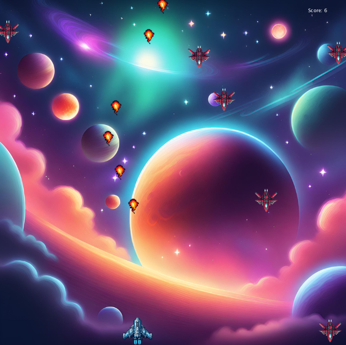
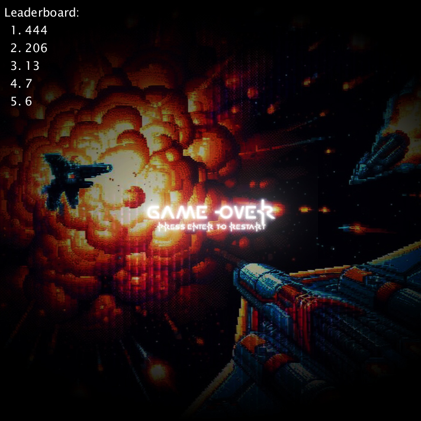

# Astral War

**Astral War is a space invaders inspired game where the user plays as a blue spaceship fighting against the incoming red spaceships.**
 
 
**Easy Mode:**
 
Destroy as many spaceships as possible without getting hit.
 
 
**Hard Mode:**
 
Destroy spaceships and prevent them from reaching the bottom of the screen and avoid getting hit.
 
 
**Gameplay Controls:**
 
Left Arrowkey: Move Left
 
Right Arrowkey: Move Right
 
Spacebar: Fire Projectiles
 
S: Activate Speed Cheat Code
 
D: Disable Speed Cheat Code
 
Tab: Pause
 
 
**Scoring:**
 
The player can obtain a higher score by destroying more spaceships (+1 per ship). The score will be displayed on the leaderboard when the player is destroyed.
 
 
**Screenshots:**
 
 
 
*Gameplay*
 
 

 
*Leaderboard*